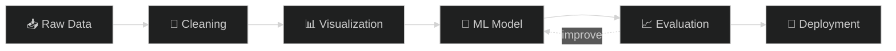
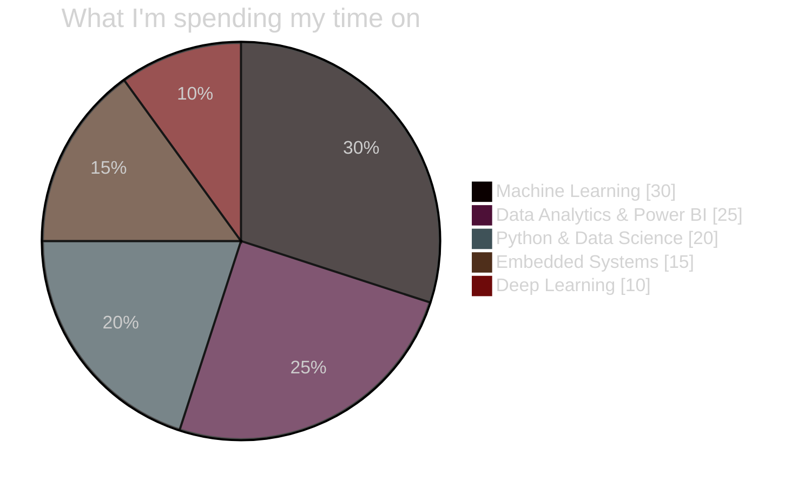
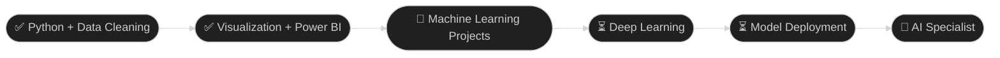
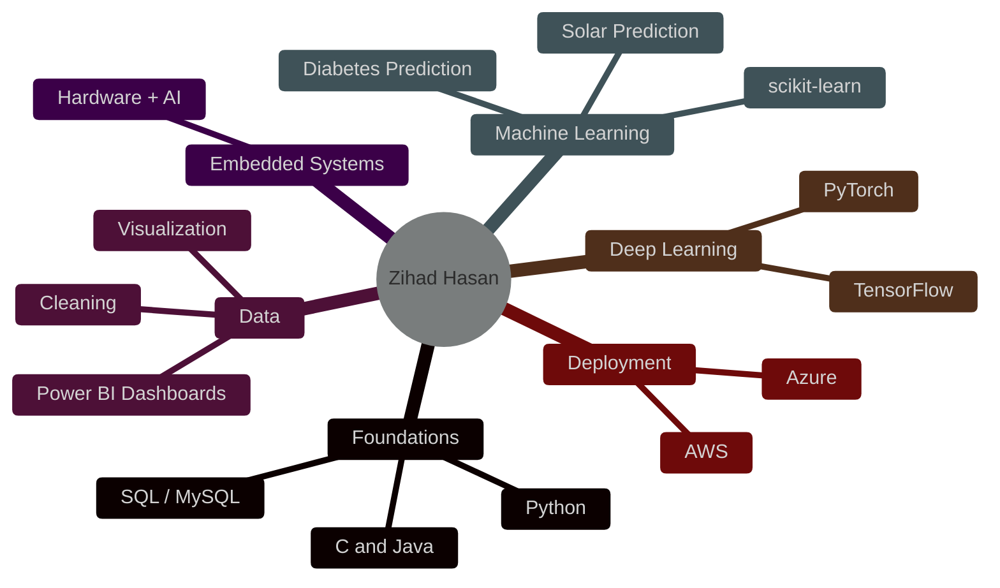

<!-- ===================== HERO ===================== -->
<div align="center">


<!-- Optional binary-rain banner: upload assets/binary-banner.svg, then swap in:
 -->

<a href="https://git.io/typing-svg"></a>

<br/>


</div>

<div align="center"></div>

```bash
zihad@github:~$ whoami
> Zihad Hasan  |  ML · AI · Embedded Systems Enthusiast

zihad@github:~$ cat mission.txt
> Turn raw data into meaningful insights, and hardware into smart solutions.

zihad@github:~$ ./status --now
> [learning]  Python · Data Science · Power BI · Deep Learning
> [building]  SolarPrediction · Diabetes Prediction
> [seeking]   open-source collaborators · ML deployment help
```

<details>
<summary><b>🔓 Decode me (binary → text) — click to expand</b></summary>
<br/>

```text
01001000 01100101 01101100 01101100 01101111 00101100 00100000 01010111 01101111 01110010 01101100 01100100 00100001 00100000 01001001 00100111 01101101 00100000 01011010 01101001 01101000 01100001 01100100 00101110
01001101 01001100 00100000 01111100 00100000 01000001 01001001 00100000 01111100 00100000 01000101 01101101 01100010 01100101 01100100 01100100 01100101 01100100
01000110 01110101 01110100 01110101 01110010 01100101 00100000 01000001 01001001 00100000 01010011 01110000 01100101 01100011 01101001 01100001 01101100 01101001 01110011 01110100
```

> 💡 Paste any line into a binary-to-text converter to read it.

</details>

### ⏱️ Live Binary Clock & Daily Tip

<!--AUTO_START-->
> 🕒 **Last sync (UTC, binary):** `00110 : 000111` → 06:07 on 28 Sep 2026  
> 💡 **ML tip of the day:** More data usually beats a fancier algorithm.
<!--AUTO_END-->

<div align="center"></div>

<div align="center"></div>

I'm a passionate **Machine Learning, AI, and Embedded Systems enthusiast** who loves exploring how **data, algorithms, and hardware** come together to build smart solutions.
My goal is to grow into a skilled **AI Specialist** by working on real-world projects and continuously learning new technologies. 🚀

<table>
<tr>
<td width="50%" valign="top">

### 🔭 Currently Working On
- ☀️ **SolarPrediction** – ML-based solar output forecasting
- 🩺 **Diabetes Prediction** – health-data classification model

### 🌱 Currently Learning
- 🐍 Python & Data Science
- 📊 Power BI
- 🤖 Machine Learning & Deep Learning
- 🔌 Embedded System Development

</td>
<td width="50%" valign="top">

### 👯 Looking to Collaborate On
- Open-source AI projects
- Data visualization
- Automation

### 🤝 Looking for Help With
- Deep learning
- Real-world deployment of ML models

### 💬 Ask Me About
- Data cleaning & visualization
- Power BI dashboards
- Beginner-friendly ML workflows

</td>
</tr>
</table>

> ⚡ **Fun fact:** I love turning raw data into meaningful insights — and sometimes into cool visuals!

<div align="center"></div>

<div align="center"></div>

<div align="center">

<a href="https://github.com/zihad2231/SolarPrediction"></a>
<a href="https://github.com/zihad2231/Diabetes-Prediction"></a>

</div>

<div align="center"></div>

<div align="center"></div>



<div align="center"></div>

<div align="center"></div>

<div align="center">


<br/><br/>

**Languages**


**Machine Learning & Data Science**


**Cloud, Databases & Tools**


**Design**


</div>

<div align="center"></div>

<div align="center"></div>

```text
Python            ████████░░  80%
Data Cleaning     ████████░░  80%
Visualization     ███████░░░  70%
Power BI          ██████░░░░  60%
Machine Learning  ██████░░░░  60%
Embedded Systems  █████░░░░░  50%
Deep Learning     ███░░░░░░░  30%
Deployment        ███░░░░░░░  30%
```



<div align="center"></div>

<div align="center"></div>





<div align="center"></div>

<div align="center"></div>

<div align="center">

**The snake is eating my contributions. Keep committing to feed it!** 🐍


<br/><br/>

**My contributions as a 3D city** 🧊


</div>

<div align="center"></div>

<div align="center"></div>

<div align="center"><i>Think you can read binary? Click each question to reveal the answer.</i></div>

<br/>

<details>
<summary><b>Level 1 🟢</b> What is <code>00001010</code> in decimal?</summary>

<br/>

**10** → `8 + 2 = 10`

</details>

<details>
<summary><b>Level 2 🟡</b> Decode this word: <code>01000001 01001001</code></summary>

<br/>

**AI** → `01000001` = 65 = `A`, `01001001` = 73 = `I`

</details>

<details>
<summary><b>Level 3 🟠</b> How many different values can 8 bits (1 byte) store?</summary>

<br/>

**256** → `2⁸ = 256`, from 0 to 255

</details>

<details>
<summary><b>Level 4 🔴</b> Write <code>42</code> in binary.</summary>

<br/>

**00101010** → `32 + 8 + 2 = 42`

</details>

<details>
<summary><b>🏆 Boss Level</b> Decode: <code>01001101 01001100</code></summary>

<br/>

**ML** → you just read my favourite field in binary! 🎉 Say hi at zihad223193@gmail.com

</details>

<div align="center"></div>

<div align="center"></div>

<div align="center">


<br/>


<br/><br/>


<br/><br/>


<br/><br/>


<br/>


</div>

<div align="center"></div>

<div align="center"></div>

<div align="center">

*Got an idea in AI, data visualization, or automation? Let's talk.*

<br/>

[](mailto:zihad223193@gmail.com)
[](https://www.linkedin.com/in/zihad-hasan2231)
[](https://x.com/zihad_hasan_1)
[](https://www.youtube.com/@zihad2231)
[](https://www.facebook.com/zihad.hasan3895)
[](https://www.instagram.com/__hunter_shark/)
[](https://discord.gg/zihadhasan3895)

<br/>

*He/Him · 📫 zihad223193@gmail.com*


</div>
